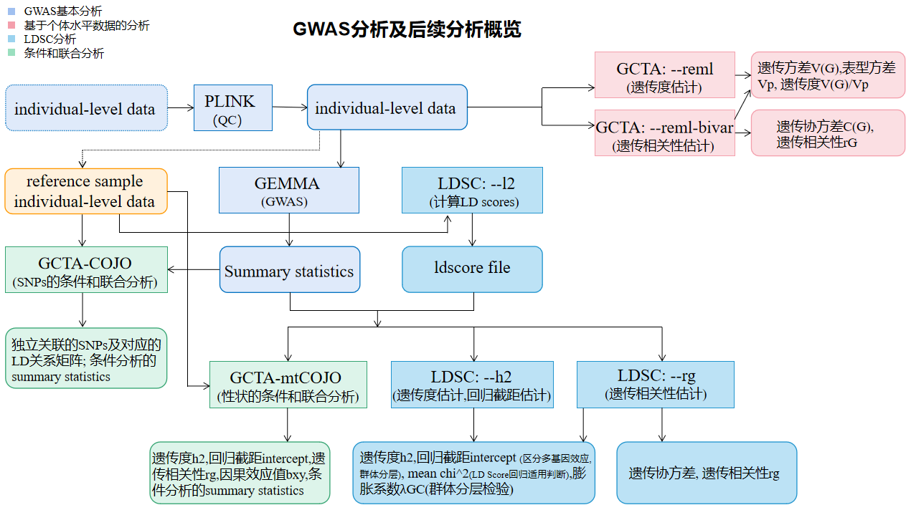

# GWAS基本分析

主要包括软件下载及安装、数据质控、计算亲缘关系矩阵、关联分析及绘图等内容。

参考GEMMA User Manual (Xiang Zhou,2020/09/30)


### 背景介绍

GWAS：全基因组关联分析，用来寻找与表型相关的SNPs。

GEMMA： Genome-wide Efficient Mixed Model Association algorithm；是一款基于混合线性模型的GWAS分析软件。相比较于其他基于混合线性模型的软件，它有如下优势：1.快速：远远快于其他精确算法（EMMA和FaST-LMM）。2.准确：EMMAX和GRAMMAR都采用固定零模型中的方差组分不变的策略来提高运算速度，其实就是一种近似算法，不如GEMMA准确。3.方便：可直接使用plink二进制格式数据，无需进行复杂的数据格式转换。4.功能全面：可进行单变量GWAS、多变量（多性状）GWAS分析等。另外，对于品种级别的表型关联分析，文献中多使用GEMMA软件。




### 软件下载和安装

| 软件包 |   版本号   | 语言  | 安装环境              | 下载地址                                                     |
| :----: | :--------: | ----- | --------------------- | ------------------------------------------------------------ |
| GEMMA  |   0.98.3   | C/C++ | Windows或Linux        | https://github.com/genetics-statistics/GEMMA/releases/download/0.98.3/gemma-0.98.3-linux-static.gz |
| PLINK  | v1.90b6.24 | C/C++ | Windows、macOS或Linux | https://s3.amazonaws.com/plink1-assets/plink_linux_x86_64_20210606.zip |

#### 软件包下载

网址：[Releases · genetics-statistics/GEMMA · GitHub](https://github.com/genetics-statistics/GEMMA/releases)

```bash
#下载gemma
wget https://github.com/genetics-statistics/GEMMA/releases/download/0.98.3/gemma-0.98.3-linux-static.gz
#下载plink
mkdir bin
cd bin 
wget https://s3.amazonaws.com/plink1-assets/plink_linux_x86_64_20210606.zip
```

#### 安装

```bash
#安装gemma
md5sum gemma-0.98.3-linux-static.gz #检查文件完整性
gzip -d gemma-0.98.3-linux-static.gz #解压
chmod a+x gemma-0.98.3-linux-static #添加执行权限
./gemma-0.98.3-linux-static #运行测试
#安装plink
unzip plink_linux_x86_64_20210606.zip
```


### 使用说明及建议

#### 输入和输出

| 命令                      | 输入（格式）                               | 输出（格式）                                 |
| :------------------------ | :----------------------------------------- | :------------------------------------------- |
| plink                     | PLINK 二进制文件(`.bim`,`.fam`,`.bed`文件) | 同输入(仅用以质控)                           |
| gemma-0.98.3-linux-static | PLINK 二进制文件(`.bim`,`.fam`,`.bed`文件) | summary statistics, 保存在`.assoc.txt`文件中 |

#### 重要单参数

##### PLINK

| 参数       | 说明                             | 默认值                     | 推荐值（文献/网址） |
| ---------- | -------------------------------- | -------------------------- | ------------------- |
| --bfile    | 输入文件名前缀                   | 格式: `.bim`,`.fam`,`.bed` |                     |
| --out      | 输出文件名前缀                   |                            |                     |
| --make-bed | 生成`.bim`,`.fam`,`.bed`文件     |                            |                     |
| --dog      | 指定物种（犬）                   |                            |                     |
| --remove   | 删除个体                         |                            |                     |
| --geno     | 删除个体缺失率高于阈值的SNPs     |                            | 0.05                |
| --mind     | 删除基因型缺失率高于阈值的个体   |                            | 0.05                |
| --maf      | 删除次等位基因频率低于阈值的SNPs |                            | 0.05                |

##### GEMMA

| 参数       | 说明                                                         | 默认值                     | 推荐值（文献/网址） |
| ---------- | ------------------------------------------------------------ | -------------------------- | ------------------- |
| -bfile     | 输入文件名前缀（PLINK 二进制文件）                           | 格式: `.bim`,`.fam`,`.bed` |                     |
| -o         | 输出文件名前缀                                               |                            |                     |
| -gk [num]  | 计算亲缘关系矩阵 (1: 计算中心亲缘关系矩阵；2: 计算标准亲缘关系矩阵) | 1                          |                     |
| -k         | 输入亲缘关系矩阵文件名                                       |                            |                     |
| -n         | 指定表型列                                                   | 1                          |                     |
| -lmm [num] | 回归分析（1: Wald test ；2: likelihood ratio test ；3: score test ；4: all 1-3） | 1                          | 1                   |

#### 参数组合

暂无


### 辅助脚本

#### 脚本清单

| 作者        | 脚本                                           | 语言 | 目的                         | 输入（格式）                                  | 输出（格式）                       |
| :---------- | :--------------------------------------------- | ---- | ---------------------------- | --------------------------------------------- | :--------------------------------- |
| Dongmei Han | [non_dog.R](scripts\gemma\non_dog.R)           | R    | 获取非犬类个体列表           | plink的`.fam`文件，包含有非犬类物种名字的文档 | 文本文件                           |
| Dongmei Han | [add_allpheno.R](scripts\gemma\add_allpheno.R) | R    | 补充`dogs.fam`缺失的表型信息 | plink的`.fam`文件                             | plink的`.fam`文件                  |
| Dongmei Han | [manhatan.R](scripts\gemma\manhatan.R)         | R    | 绘制曼哈顿图和QQ-plot图      | gemma的关联分析结果`.assoc.txt`文件           | 包含有曼哈顿图和QQ-plot图的pdf文件 |

#### 脚本参数

无


### 实例分析流程

#### 数据准备

##### plink文件介绍

包括：`.bim`,`.fam`,`.bed`,`.ped`,`.map`文件以及协变量文件

（1）`.ped`文件：个体信息及相应基因型

（2）`.map`文件：SNPs的信息

（3）`.bim`文件：plink二进制文件，包含SNPs的信息

（4）`.fam`文件：plink二进制文件，包含个体信息

（5）`.bed`文件：plink二进制文件，包含个体ID和基因型

（6）协变量文件：包含个体的协变量信息


##### 该分析所用文件

包括：`dogs.bim`,`dogs.fam`,`dogs.bed`文件，所用物种为犬，共包含5998个个体，6619508个SNPs。

文件内容如下：（其中,`dogs.fam`文件中表型信息缺失）


#### 基本质控

删除数据集中不属于犬的个体；

对数据集以MAF>0.05, 基因型缺失率<0.05(--geno), 个体基因型缺失率<0.05(--mind)为条件进行质量控制。

```bash
export PATH=$PATH:~/bin
cd /picb/bigdata/project/handongmei/gemma/0419
plink --bfile /picb/bigdata/project/dogs/0_data/dogs --dog --remove breed_del.txt --make-bed --out dogs_remove         #删除不属于犬的个体
plink --bfile dogs_remove --dog --geno 0.05 --mind 0.05 --maf 0.05 --make-bed --out dogs_qc                       #质控
mv dogs_qc.fam dogs.fam
```

#### 补全表型信息

原始文件`dogs_qc.fam`表型值一列为缺失值，利用搜集到的表型信息进行补充。

```R
#R script-add_allpheno.R
pheno<-read.csv('pheno_luo.csv')
dogfam<-read.table('dogs.fam')
for (i in 1:dim(dogfam)[1]){
  for (j in 1:dim(pheno)[1]){
    if (dogfam[i,1]==pheno[j,2]){
      for (k in 3:dim(pheno)[2]){
        dogfam[i,3+k]<-pheno[j,k]
      }
    }
  }
}
write.table(dogfam,'dogs_qc.fam',quote = F,row.names = F,col.names = F)
```

```bash
Rscript add_allpheno.R
```


#### 计算亲缘关系矩阵

输入文件：`.bed`,`.bim`,`.fam`文件

输出文件：产生一个output文件夹，包含`.cXX.txt`,`.log.txt`文件

```bash
nohup gemma-0.98.3-linux-static -bfile dogs_qc -gk 1 -o dog_matrix &
```

输出文件介绍：

（1）`.log.txt`文件

包含运行参数、计算时间等详细信息。

（2）`.cXX.txt`文件

包含一个n X n的亲缘关系矩阵。

#### 关联分析

输入文件：`.bed`,`.bim`,`.fam`,`.cXX.txt`文件

输出文件：产生一个output文件夹，包含`.assoc.txt`,`.log.txt`文件

```bash
mkdir cephalic_index
mkdir earbend
mkdir eyeshape
mkdir eartip
mkdir tailcurve
mkdir skull_length
cd cephalic_index
nohup gemma-0.98.3-linux-static -bfile ../dogs_qc -k ../output/dog_matrix.cXX.txt -n 4 -lmm 1 -o cephalicindex &
cd ../earbend
nohup gemma-0.98.3-linux-static -bfile ../dogs_qc -k ../output/dog_matrix.cXX.txt -n 14 -lmm 1 -o earbend &
cd ../eyeshape
nohup gemma-0.98.3-linux-static -bfile ../dogs_qc -k ../output/dog_matrix.cXX.txt -n 31 -lmm 1 -o eyeshape &
cd ../eartip
nohup gemma-0.98.3-linux-static -bfile ../dogs_qc -k ../output/dog_matrix.cXX.txt -n 32 -lmm 1 -o eartip &
cd ../tailcurve
nohup gemma-0.98.3-linux-static -bfile ../dogs_qc -k ../output/dog_matrix.cXX.txt -n 16 -lmm 1 -o tailcurve &
cd ../skull_length
nohup gemma-0.98.3-linux-static -bfile ../dogs_qc -k ../output/dog_matrix.cXX.txt -n 2 -c height_cov.txt -lmm 1 -o skulllength &
```

```bash
sort -t $'\t' -gk 12 tailcurve.assoc.txt -o sort_p_tailcurve.txt
# 对文件按P值大小排序，默认升序，$'\t'=='\\t'
#-t指定分隔符，-g按通用数值排序，支持科学计数法，-k指定按哪列排序
```

输出文件介绍：

（1）`.log.txt`文件

包含运行参数、计算时间等详细信息以及在空线性混合模型下的PVE估计值和它的标准误。

（2）`.assoc.txt`文件


11列分别代表：(新版gemma软件已在`.assoc.txt`输出结果中删除logl_H1)


#### 绘制曼哈顿图和QQ-plot图

关联分析结果已下载至本地

```R
#R script- manhatan.R
library(qqman)
setwd('F:/hdm_0420')
manhattan_dog<-function(filename,picturename){
gwasresults<-read.table(paste0(filename,'.txt'),header = T)
pdf(paste0(picturename,".pdf"))
n<-dim(gwasresults)[1]
p0<-0.05/n
manhattan(gwasresults,chr = "chr", bp = "ps", p = "p_wald", snp = "rs",main = paste0("Manhattan Plot: ",picturename),chrlabs=as.character(c(1:39)),xlab='chromosome',cex = 0.6, cex.axis = 0.5,col = c("blue4", "orange3"),suggestiveline = F, genomewideline = -log10(p0))
dev.off()
pdf(paste0(picturename,'_qqplot',".pdf"))
qq(gwasresults$p_wald, main = "Q-Q plot of GWAS p-values", pch = 18, col = "blue4", las = 1)
dev.off()
}
manhattan_dog('earbend.assoc','earbend')
manhattan_dog('eartip.assoc','eartip')
manhattan_dog('eyeshape.assoc','eyeshape')
manhattan_dog('tailcurve.assoc','tailcurve')
manhattan_dog('skulllength.assoc','skulllength')
manhattan_dog('cephalicindex.assoc','cephalicindex')
```


注: 多变量GWAS不适用于品种级别数据，计算时间过长。


### 参考文献

Xiang Zhou and Matthew Stephens (2012). Genome-wide efficient mixed-model analysis for association studies. Nature Genetics. 44: 821-824.
