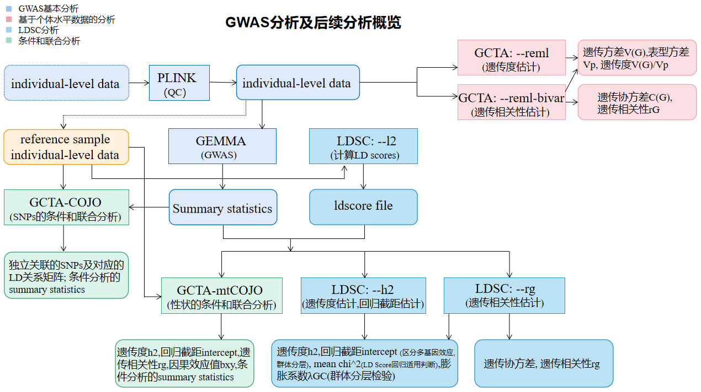
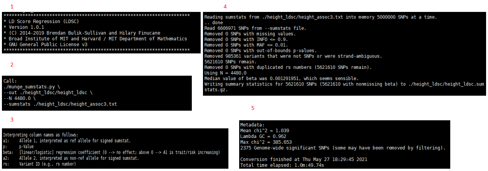
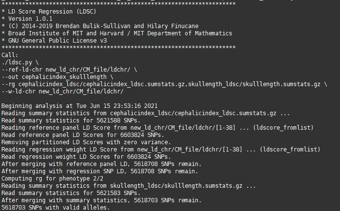

# LDSC分析

主要包括使用LDSC软件计算LD Scores，估计遗传度、回归截距以及估计遗传相关性。




## 一、使用LDSC计算LD Scores


### 背景介绍

LDSC(LD SCore): 一个命令行工具，用于从GWAS的汇总统计（summary stastics）中估计遗传度和遗传相关性，ldsc也计算LD Scores。

主要功能包括：估计 LD Scores；估计遗传度（h2 、partitioned h2）；估计遗传相关性（genetic correlation）；估计LD Score回归截距（ the LD Score regression intercept）。


### 软件下载与安装 

参考：[GitHub - bulik/ldsc: LD Score Regression (LDSC)](https://github.com/bulik/ldsc#readme)

#### 下载ldsc

```bash
git clone https://github.com/bulik/ldsc.git
cd ldsc
```

#### 安装Python依赖项，创建一个包含LDSC依赖项的环境

```bash
source ~/miniconda3/bin/activate           #进入base环境
conda env create --file environment.yml
source activate ldsc
```

#### 测试安装是否成功

```bash
./ldsc.py -h
./munge_sumstats.py -h
```

如图：

#### 更新到最新版本ldsc(可选)

```bash
cd ldsc
git pull #如果ldsc是最新版本，出现如下提示：Already up-to-date.
conda env update --file environment.yml  #更新LDSC环境
```


### 使用说明及建议

#### 输入和输出

| 命令    | 输入（格式）                               | 输出（格式）                                                 |
| ------- | ------------------------------------------ | ------------------------------------------------------------ |
| plink   | PLINK 二进制文件(`.bim`,`.fam`,`.bed`文件) | 同输出（划分为单个染色体；填补遗传距离信息，单位CM）         |
| ldsc.py | PLINK 二进制文件(`.bim`,`.fam`,`.bed`文件) | ld scores相关文件，保存在`.M`,`.M_5_50`, `.ldscore.gz`文件中。 |

#### 重要单参数

##### PLINK

| 参数       | 说明                                              | 默认值                     | 推荐值（文献/网址） |
| ---------- | ------------------------------------------------- | -------------------------- | ------------------- |
| --bfile    | 输入文件名前缀，`.bim`,`.fam`,`.bed`文件          | 格式: `.bim`,`.fam`,`.bed` |                     |
| --out      | 输出文件名前缀                                    |                            |                     |
| --make-bed | 生成`.bim`,`.fam`,`.bed`文件                      |                            |                     |
| --dog      | 指定物种（犬）                                    |                            |                     |
| --chr      | 指定染色体                                        |                            |                     |
| --cm-map   | 使用SHAPEIT格式的重组率文件填补SNPs的遗传距离信息 |                            |                     |

##### LDSC

| 参数           | 说明                                                         | 默认值                     | 推荐值（文献/网址） |
| -------------- | ------------------------------------------------------------ | -------------------------- | ------------------- |
| --bfile        | 输入文件名前缀（PLINK 二进制文件前缀）,为参考样本个体水平数据 | 格式: `.bim`,`.fam`,`.bed` |                     |
| --out          | 输出文件名前缀                                               |                            |                     |
| --l2           | 告诉ldsc计算LD Scores                                        |                            |                     |
| --ld-wind-cm n | 告诉lsdc使用一个n cM的窗口来估计LD Scores，允许窗口大小随LD的范围而变化 |                            | 1                   |
| --ld-wind-kb   | 定义窗口大小，单位是kb                                       |                            |                     |
| --ld-wind-snp  | 定义窗口大小，单位是SNP的数量                                |                            |                     |

#### 参数组合

暂无


### 辅助脚本

#### 脚本清单

| 作者        | 脚本                              | 语言 | 目的                                                   | 输入（格式）             | 输出（格式）             |
| :---------- | :-------------------------------- | ---- | ------------------------------------------------------ | ------------------------ | :----------------------- |
| Dongmei Han | [cm_map.R](scripts/ldsc/cm_map.R) | R    | 整理遗传图谱格式，包括三列：物理位置、重组率和遗传位置 | 包含重组率信息的文本文件 | 包含重组率信息的文本文件 |

#### 脚本参数

无


### 实例分析流程

#### 获取单染色体plink二进制文件

注：仅使用常染色体

输入文件：plink二进制格式文件，`.bed/.bim/.fam`（eg: dogs_qc.bed, dogs_qc.bim, dogs_qc.fam）

输出文件：38个plink二进制格式文件（`.bed/.bim/.fam`），每一个文件代表一个染色体

```bash
 for q in $(seq 1 38); do plink --bfile ~/handongmei_data/gemma/0419/dogs_qc --dog --chr $q --make-bed --out chr$q; done 
```

#### 补充遗传距离信息 (cM)

输入文件：plink二进制格式文件，`.bed/.bim/.fam`（chrn.bed,chrn.bim,chrn.fam）; SHAPEIT格式重组率文件

输出文件：plink二进制格式文件，`.bed/.bim/.fam`, 填充了遗传距离信息（chrn.bed,chrn.bim,chrn.fam）

1、使用脚本`cm_map.R`整理遗传图谱格式-对SHAPEIT格式重组率文件进行操作

```bash
cp /picb/bigdata/project/dogs/0_data/maps/raw/mark* ./
gunzip mark*
sed -i '1d' mark*
Rscript cm_map.R
```


注：--cm-map需要[SHAPEIT](https://shapeit.fr/)格式的重组率文件。


2、执行程序进行遗传距离信息填补

```bash
plink --dog --bfile chr1 --cm-map genetic_map_chr@.txt --make-bed --out ./CM_file/chr1
plink --dog --bfile chr2 --cm-map genetic_map_chr@.txt --make-bed --out ./CM_file/chr2
...
```


#### 计算LD Scores

输入文件：plink二进制格式文件,`.bed/.bim/.fam`文件, 包含有遗传距离信息（chrn.bed,chrn.bim,chrn.fam）

输出文件：`.log`，`.l2.M`, `.l2.M_5_50`，`.l2.ldscore.gz`文件

```bash
nohup python ~/handongmei_data/gemma/0419/ldsc/ldsc.py --bfile chr1 --l2 --ld-wind-cm 1 --out ldchr/1 &
nohup python ~/handongmei_data/gemma/0419/ldsc/ldsc.py --bfile chr2 --l2 --ld-wind-cm 1 --out ldchr/2 &
...
#可直接使用下列代码
#for q in $(seq 1 38); do python ~/handongmei_data/gemma/0419/ldsc/ldsc.py --bfile chr$q --l2 --ld-wind-cm 1 --out ldchr/q &; done 
```

注：--bfile 指定参考样本个体水平数据。

In order to estimate LD Scores, you need genotype data in the binary `plink` `.bed/.bim/.fam` format. We recommend using 1000 Genomes data from the appropriate continent, which can be downloaded in `vcf` format from the [1000 Genomes FTP site](ftp://ftp.1000genomes.ebi.ac.uk/vol1/ftp/release/20130502/) and converted to `plink` format using the [`plink --vcf`](https://www.cog-genomics.org/plink2/input#vcf) command.

输出文件介绍 (展示1号染色体)：

（1）  `.log`文件

第一部分：软件基本信息和命令行选项的列表

第二部分：包含了描述读取.bed/.bim/.fam文件集过程的日志信息。 ldsc默认会删除单态SNP；可以用'--maf'标志来改变MAF下限

第三部分：关于LD Scores的一些基本metadata数据，帮助进行质量检查。（例如：LD Score一般应与MAF呈正相关关系；一般来说只有少数LD Score应该<1）


（2）  `.l2.M`, `.l2.M_5_50`文件

统计了`.bed/.bim/.fam`文件集中的SNPs的数量。

`.l2.M`文件包含SNPs的总数；`.l2.M_5_50`文件包含次等位基因频率高于5%的SNPs的数量。默认情况下，ldsc使用`.l2.M_5_50`文件来估计遗传度。


（3）  `.l2.ldscore.gz`文件

包含LD Scores的文件，默认使用gzip压缩。

四列分别是CHR = chromosome, SNP = rs number, BP = base pair,L2 = LD Scores。

ldsc使用rs number来合并LD Score文件和汇总统计（summary statistics）；BP列仅用于确保SNPs被排序。


### 参考文献

[Standard data input - PLINK 1.9 (cog-genomics.org)](https://www.cog-genomics.org/plink2/input#cm_map)

[LD Score Estimation Tutorial · bulik/ldsc Wiki · GitHub](https://github.com/bulik/ldsc/wiki/LD-Score-Estimation-Tutorial)


## 二、使用LDSC进行遗传度、遗传相关性、LD Score回归截距估计


### 背景介绍

LDSC(LD SCore): 一个命令行工具，用于从GWAS的汇总统计 (summary stastics) 中估计遗传度和遗传相关性，ldsc也计算LD Scores。

主要功能包括：估计 LD Scores；估计遗传度 (h2 、partitioned h2)；估计遗传相关性 (genetic correlation)；   估计LD Score回归截距 (the LD Score regression intercept)。


### 使用说明及建议

#### 输入和输出

| 命令              | 输入（格式）                                                 | 输出（格式）                                                 |
| ----------------- | ------------------------------------------------------------ | ------------------------------------------------------------ |
| munge_sumstats.py | gemma关联分析结果`.assoc.txt`文件                            | summary-level数据，保存在`.sumstats`文件中                   |
| ldsc.py           | summary-level数据，`.sumstats`文件；ld score相关文件，`.M`,`.M_5_50`, `.ldscore.gz`文件 | 包含有遗传度、回归截距、相关性等信息的标准输出，保存在`.log`文件中 |

#### 重要单参数

| 参数                          | 说明                                                         | 默认值 | 推荐值（文献/网址） |
| ----------------------------- | ------------------------------------------------------------ | ------ | ------------------- |
| --h2                          | 告诉ldsc对`.sumstats`格式文件计算遗传度和LD Score回归截距    |        |                     |
| --rg                          | 告诉ldsc计算遗传相关性                                       |        |                     |
| --N                           | 指定样本大小                                                 |        |                     |
| --ref-ld-chr    eur_w_ld_chr/ | 指定ld score文件，指向所在目录, 且使用按染色体分离的LD Score文件。     a、默认情况下，ldsc将染色体号码附加到末尾。例如，输入 --ref-ld-chr eur_w_ld_chr/ 告诉 ldsc 使用   eur_w_ld_chr/1.l2.ldscore, ... , eur_w_ld_chr/22.l2.ldscore。                                                                                               b、如果染色体号码在文件名的中间，你可以通过使用@符号告诉ldsc在哪里插入染色体号码。例如，--ref-ld-chr ld/chr@                                                                              c、--ref-ld的参数应省略.l2.ldscore或.l2.ldscore.gz文件的后缀。 |        |                     |
| --w-ld-chr eur_w_ld_chr/      | `--w-ld`标志告诉ldsc使用哪些LD Score作为回归的权重。在两个回归中 (与`--ref-ld`) 使用相同的-w-ld-chr LD Scores。 |        |                     |
| --out                         | 输出到文件，文件名前缀                                       |        |                     |

#### 参数组合

暂无


### 辅助脚本

无


### 实例分析流程

#### 数据准备

将GEMMA关联分析结果`.assoc.txt`转换为ldsc格式`.sumstats`。

输入文件：Summary Statistics文件，以height为例，`height.assoc.txt`

输出文件： `.log`, `.sumstats.gz` 文件

```bash
sed 's/p_wald/p/' ./height_ldsc/height.assoc.txt > ./height_ldsc/height_assoc1.txt
sed 's/allele0/a2/' ./height_ldsc/height_assoc1.txt > ./height_ldsc/height_assoc2.txt
sed 's/allele1/a1/' ./height_ldsc/height_assoc2.txt > ./height_ldsc/height_assoc3.txt
../munge_sumstats.py --sumstats ./height_ldsc/height_assoc3.txt --N 4480 --out ./height_ldsc/height_ldsc

#质控后，过滤掉985361个SNP，保留5621610个SNPs---过滤掉太多了吧
```

注：Note that `munge_sumstats.py` interprets `A1` as the reference allele and that the `A1` column in the `.sumstats` file format refers to the reference allele.


输出文件介绍：

（1）`.log`文件

第一部分：软件基本信息

第二部分：命令行选项的列表

第三部分：描述了`munge_sumstats.py`如何解释列标题,帮助核对转换是否正确

第四部分：描述了过滤过程；默认情况下，对INFO > 0.9(imputation quality; higher --> better imputation)，MAF > 0.01和0 < P <= 1进行过滤。它还会删除不是SNP的变体（如indels），链上不明确的SNPs，以及有重复rs编号的SNPs。最后，munge_sumstats.py检查汇总统计列（β、Z、OR(Odds ratio :1 --> no effect; above 1 --> A1 is risk increasing)、log OR）的中位数是否接近空中位数（例如，OR中位数应该接近1），以确保这一列没有被误标。

第五部分：显示了关于汇总统计（summary statistics）的一些基本metadata。



（2） `.sumstats.gz` 文件

各列分别是：


#### 估计遗传度、LD Score回归截距

修改sumstats.py，以便能读取家犬38条染色体的ldscore文件。


输入文件：`.sumstats.gz`,`.M`,`.M_5_50`, `.ldscore.gz`文件

输出文件：`.log`文件

```bash
nohup ../ldsc.py --h2 height_ldsc/height_ldsc.sumstats.gz --ref-ld-chr new_ld_chr/CM_file/ldchr/ --w-ld-chr new_ld_chr/CM_file/ldchr/ --out height_h2_38 &
```

输出文件介绍：

（1）  `.log`

包含有运行时间、命令行参数、数据读取、遗传度、回归截距等信息。

LD回归截距：用于判断飘逸的QQ图是否正常，即是否真的由群体分层造成；基因多效性, 截距接近于1, 如1.004; 群体分层, 截距偏离1, 如1.30。

注：修改了染色体数，显示警告。


--h2计算的遗传度列表


#### 估计遗传相关性

输入文件：`.sumstats.gz`,`.M`,`.M_5_50`, `.ldscore.gz`文件

输出文件：`.log`文件

1、 height与weight

```bash
../ldsc.py --rg height_ldsc/height.sumstats.gz,weight_ldsc/weight.sumstats.gz --ref-ld-chr new_ld_chr/CM_file/ldchr/ --w-ld-chr new_ld_chr/CM_file/ldchr/ --out height_weight
```

输出文件介绍：

（1）`.log`文件

包括LDSC版本信息，输入命令参数，文件读取过滤等信息...


包括遗传度、遗传协方差、遗传相关性信息...


包括遗传相关结果summary列表。

各列分别是p1 = trait 1, p2 = trait 2, rg = genetic correlation, se = standard error of rg, p = p-value for rg; h2_obs, h2_obs_se = observed scale h2 for trait 2 and standard error; h2_int, h2_int_se = single-trait LD Score regression intercept for trait 2 and standard error;gcov_int, gcov_int_se = cross-trait LD Score regression intercept and standard error.


2、earbend与eartip

```bash
../ldsc.py --rg earbend_ldsc/earbend.sumstats.gz,eartip_ldsc/eartip.sumstats.gz --ref-ld-chr new_ld_chr/CM_file/ldchr/ --w-ld-chr new_ld_chr/CM_file/ldchr/ --out earbend_eartip
```


3、cephalic_index 与skull_length

```bash
../ldsc.py --rg cephalicindex_ldsc/cephalicindex_ldsc.sumstats.gz,skullength_ldsc/skulllength.sumstats.gz --ref-ld-chr new_ld_chr/CM_file/ldchr/ --w-ld-chr new_ld_chr/CM_file/ldchr/ --out cephalicindex_skulllength
```




注意事项：

1、如果平均卡方低于1.02，`munge_sumstats.py`会警告你，这些数据可能不适合用于LD Score回归。

2、 --rg计算的遗传度不同于使用 --h2计算的。

3、遗传度存在>1的情况，原因不清；另标准误过大。


### 参考文献

Bulik-Sullivan, et al. LD Score Regression Distinguishes Confounding from Polygenicity in Genome-Wide Association Studies. Nature Genetics, 2015.

Bulik-Sullivan, B., et al. An Atlas of Genetic Correlations across Human Diseases and Traits. Nature Genetics, 2015.

[GCTA document (cnsgenomics.com)](https://cnsgenomics.com/software/gcta/#mtCOJO)